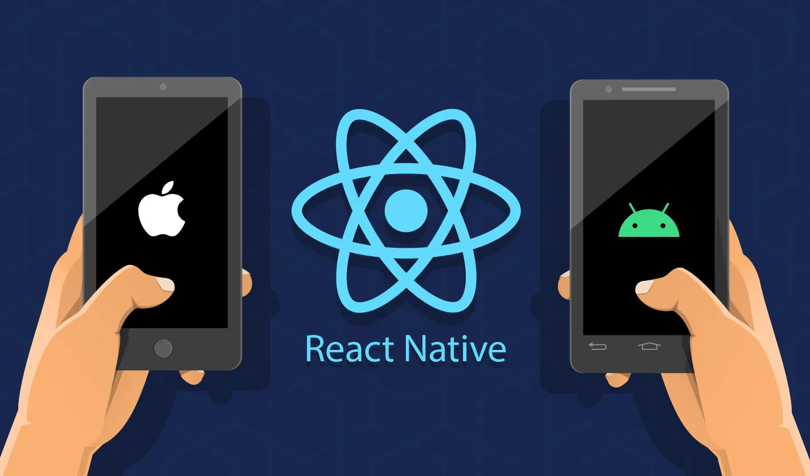

<h1 align="center">Learn React Native with Jibon</h1>

<div align="center">
<!-- Gmail Account -->
<a href="mailto:jayed.swe@gmail.com">

</a>
<a href="tel:+8801987132107">

<a href="#" target="_blank">

</a>
<a href="https://www.facebook.com/jibon969" target="_blank">


<a href="https://www.linkedin.com/in/jibon969/" target="_blank">

</a>
<a href="https://github.com/jibon969" target="_blank">

</a>
</div>

<hr/>

<div align="center">
        <a href="https://reactnative.dev/" target="_blank">React Native
        </a>
        |
        <a href="https://www.reactnative.express/" target="_blank">React Native Express</a>
        |
        <a href="https://blog.deversity.com/2021/10/combining-drawer-tab-and-stack.html" target="_blank">Combining navigators</a>
</div>
<hr/>

##### 01. How AsyncStorage Work
<details>
<summary style="cursor:pointer">Solution</summary>

```js
import {StyleSheet, Text, View, Button} from 'react-native';
import React, {useState} from 'react';
import AsyncStorage from '@react-native-async-storage/async-storage';

const App = () => {
  const [user, setUser] = useState('');

  const setData = async () => {
    // Here is name is key and value is jibon
    await AsyncStorage.setItem('name', 'jibon');
  };

  const getData = async () => {
    // when we get data we can call key property
    const name = await AsyncStorage.getItem('name');
    setUser(name);
    // console.log(name);
  };

  const removeData = async () => {
    // when we remove data we can also call key property
    await AsyncStorage.removeItem('name');
    setUser('');
  };

  return (
    <View style={styles.container}>
      <Text style={styles.heading}>AsyncStorage set, get, remove data</Text>
      <Button title="Set data" onPress={setData} />
      <Text style={styles.text}>Show Data: {user}</Text>
      <View style={styles.buttonContainer}>
        <Button title="Get data" onPress={getData} />
        <View style={styles.buttonGap} />
        <Button title="Remove data" onPress={removeData} />
      </View>
    </View>
  );
};

export default App;

const styles = StyleSheet.create({
  container: {
    flex: 1,
    justifyContent: 'center',
    alignItems: 'center',
  },
  heading: {
    fontSize: 24,
    fontWeight: 'bold',
    marginBottom: 20,
  },
  text: {
    marginVertical: 10,
  },
  buttonContainer: {
    flexDirection: 'row',
  },
  buttonGap: {
    width: 10,
  },
});

```
</details>


##### 02. React Native Vector Icons
<details>
<summary style="cursor:pointer">Solution</summary>

```js
// https://www.npmjs.com/package/react-native-vector-icons
// Android Setup
// Go to => android/app/build.gradle (NOT android/build.gradle) and add:
// apply from: file("../../node_modules/react-native-vector-icons/fonts.gradle")

```
</details>

---
**[⬆ Back to Top](#header)**
